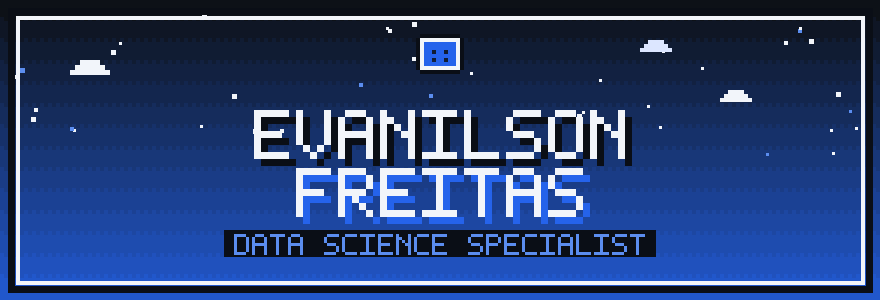
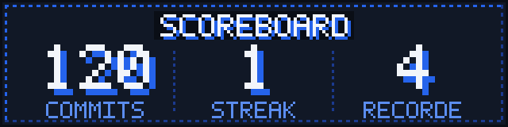
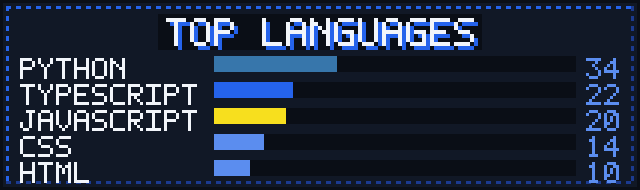

<!--
  GitHub Profile - @EvanilsonFreitas
  Design system 8-BIT - todos os graficos sao SVG proprios em /assets
  (carregam do proprio GitHub, sem servico externo). Sem emoji.
  Para editar a arte: rode  python gen_final.py  (ver /assets/README-assets.txt)
-->

<div align="center">



</div>


<h2>&nbsp; PLAYER &middot; SOBRE</h2>

<table>
<tr>
<td valign="top" width="60%">

<br />

Sou **Especialista em Data Science** e gosto mesmo é de pegar grandes volumes de dados e transformar em algo útil pro negócio. No fim, tudo isso serve pra uma coisa: ajudar a decidir melhor.

No dia a dia eu misturo **análise estatística**, **engenharia de dados** e **visualização**. Já construí dashboards em Power BI, automações em Python e produtos web em Next.js, sempre pensando na experiência de quem vai usar.

Pra mim, boa análise é invisível. O usuário não enxerga o modelo, ele enxerga a decisão certa.

<br />

</td>
<td valign="top" width="40%">

<br />

```yaml
PLAYER:   Evanilson Freitas
CLASSE:   Data Science Specialist
FOCO:     Analytics & Automation
ARMAS:    Python . SQL . Power BI
BASE:     Sao Paulo, Brasil
STATUS:   [ON] Aberto a projetos
```

<div align="center">
<a href="https://www.linkedin.com/in/evanilson-p-freitas-303889350/"></a>
&nbsp;
<a href="mailto:Evanilson.pessoal@outlook.com"></a>
&nbsp;
<a href="https://github.com/EvanilsonFreitas"></a>
</div>

</td>
</tr>
</table>

<h2>&nbsp; CLASSES &middot; AREAS DE ATUACAO</h2>

<table>
<tr>
<td width="33%" align="center" valign="top">

<br />

### DATA SCIENCE

<sub>
Modelagem estatística,<br/>
machine learning aplicado<br/>
e análise preditiva para<br/>
problemas reais do negócio.
</sub>

<br />

</td>
<td width="33%" align="center" valign="top">

<br />

### ANALYTICS & BI

<sub>
Dashboards executivos,<br/>
modelagem dimensional<br/>
e storytelling com dados<br/>
pra tomada de decisão.
</sub>

<br />

</td>
<td width="33%" align="center" valign="top">

<br />

### DATA ENGINEERING

<sub>
Pipelines de ETL,<br/>
integrações via API<br/>
e automações que<br/>
escalam a operação.
</sub>

<br />

</td>
</tr>
</table>


<h2>&nbsp; INVENTORY &middot; STACK TECNICA</h2>

<table>
<tr>
<td valign="top" width="50%">

**LINGUAGENS & DADOS**

`Python` `TypeScript` `JavaScript` `SQL` `DAX`

<br />

**DATA SCIENCE & ML**

`Pandas` `NumPy` `SciPy` `Sklearn` `Jupyter`

<br />

**ANALYTICS & BI**

`Power BI` `Excel` `PostgreSQL` `SQL Server` `Power Query`

</td>
<td valign="top" width="50%">

**WEB & PRODUTO**

`Next.js` `React` `Node.js` `Tailwind`

<br />

**DESIGN . TOOLING . INFRA**

`Figma` `Git` `GitHub` `VS Code` `Vercel` `Docker`

</td>
</tr>
</table>


<h2>&nbsp; QUEST LOG &middot; EM DESENVOLVIMENTO</h2>

```diff
@@  NO QUE ESTOU MEXENDO AGORA  @@

+ [##########] Modelos preditivos aplicados a dados de negócio
+ [########..] Pipelines analíticos juntando Python, SQL e Power BI
+ [######....] Produtos SaaS voltados pra automação inteligente
! [####......] Cavando MLOps e arquitetura de dados em escala
# [###.......] Brincando com IA generativa dentro de fluxos analíticos
```

<h2>&nbsp; WORLD MAP &middot; PROJETOS EM DESTAQUE</h2>

<table>
<tr>
<td valign="top" width="50%">

### CreamCherry &middot; Site

<sub>
Plataforma web institucional feita em HTML, CSS e
JavaScript. Foco em performance, acessibilidade e
um visual bem consistente.
</sub>

<br /><br />

`HTML` `CSS` `JavaScript`

<br />

**[ > JOGAR ](https://github.com/EvanilsonFreitas/creamcherry-site)**

</td>
<td valign="top" width="50%">

### CreamCherry &middot; API

<sub>
Backend em Python da aplicação CreamCherry.
Endpoints REST, autenticação e integração com
a camada de dados.
</sub>

<br /><br />

`Python` `REST` `API`

<br />

**[ > JOGAR ](https://github.com/EvanilsonFreitas/creamcherry-api)**

</td>
</tr>
<tr>
<td valign="top" width="50%">

### Portfólio Pessoal

<sub>
Portfólio em Next.js e TypeScript com design
minimalista. Uma vitrine dos projetos, da stack
e dos canais de contato.
</sub>

<br /><br />

`Next.js` `TypeScript` `React`

<br />

**[ > JOGAR ](https://github.com/EvanilsonFreitas/portfolio-evanilson)**

</td>
<td valign="top" width="50%">

### Card Product &middot; Panda Clothing

<sub>
Card de produto pra loja online. Um estudo de
layout, microinterações e responsividade feito
só com CSS.
</sub>

<br /><br />

`CSS` `HTML` `UI Design`

<br />

**[ > JOGAR ](https://github.com/EvanilsonFreitas/Card-Product-PandaClothing)**

</td>
</tr>
</table>


<h2>&nbsp; SCOREBOARD &middot; ESTATISTICAS</h2>

<div align="center">



<br /><br />



</div>


<h2>&nbsp; COMBO &middot; COMO EU TRABALHO</h2>

<table>
<tr>
<td valign="top" width="25%" align="center">

### ENTENDER

<sub>
Mergulhar no problema<br/>
antes de sair codando.
</sub>

</td>
<td valign="top" width="25%" align="center">

### MODELAR

<sub>
Dados estruturados<br/>
e hipóteses claras.
</sub>

</td>
<td valign="top" width="25%" align="center">

### VALIDAR

<sub>
Teste estatístico<br/>
e métricas honestas.
</sub>

</td>
<td valign="top" width="25%" align="center">

### ENTREGAR

<sub>
Visual claro<br/>
e ação que dá pra tomar.
</sub>

</td>
</tr>
</table>

<div align="center">

`ENTENDER` &gt; `MODELAR` &gt; `VALIDAR` &gt; `ENTREGAR`

</div>


<h2>&nbsp; MULTIPLAYER &middot; VAMOS CONVERSAR</h2>

<table>
<tr>
<td valign="top" width="50%">

### ABERTO PARA

- Projetos de **Data Science** e modelagem preditiva
- Soluções de **Analytics & Business Intelligence**
- Desenvolvimento de **produtos SaaS** movidos a dados
- Consultoria em **automação** e engenharia analítica
- Parcerias em **pesquisa aplicada**

</td>
<td valign="top" width="50%">

### CANAIS DE CONTATO

- **Email:** [Evanilson.pessoal@outlook.com](mailto:Evanilson.pessoal@outlook.com)
- **LinkedIn:** [evanilson p freitas](https://www.linkedin.com/in/evanilson-p-freitas-303889350/)
- **GitHub:** [@EvanilsonFreitas](https://github.com/EvanilsonFreitas)
- **Onde estou:** São Paulo, Brasil

</td>
</tr>
</table>


<div align="center">
  <sub>
    <b>THANKS FOR PLAYING &middot; INSERT COIN</b>
    <br /><br />
    <i>Design e código por Evanilson Freitas.</i>
    <br />
    <i>Feito com foco em clareza, performance e decisão baseada em dados.</i>
  </sub>
  <br /><br />
</div>
